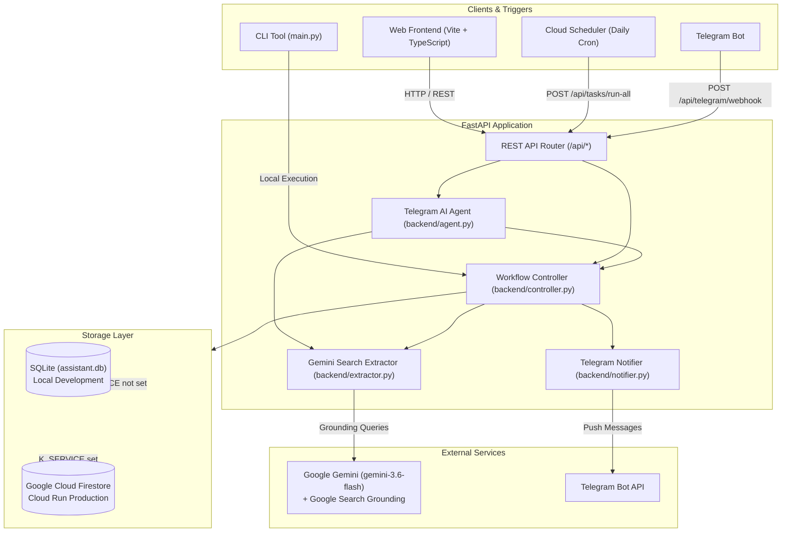

# Personal Search Assistant

An autonomous AI-powered search and monitoring agent built with **FastAPI**, **Google Gemini AI**, and **TypeScript + Vite**.

Define recurring or ad-hoc web search queries in plain natural language (e.g., *"Find Java backend jobs in Tel Aviv"*, *"Monitor rent drops in downtown"*). The assistant leverages **Gemini with live Google Search Grounding** to query real-time web results, extracts structured items (title, link, description, location), persists execution state, and delivers notifications to **Telegram**, a **modern Web UI**, and a **CLI**.

---

## Architecture Overview



---

## Key Features

- 🔍 **Natural Language Search Queries**: No custom scrapers or query syntax required. Just describe what you want to find or track.
- ⚡ **Live Google Search Grounding**: Powered by Gemini (`gemini-3.6-flash`) with dynamic Google Search Grounding to fetch current, live web data.
- 🏷️ **Smart Auto-Naming**: Automatically derives a concise 3–5 word title (e.g., *"Tel Aviv Java Backend Jobs"*) when new tasks are created and executed.
- 🤖 **Interactive Telegram AI Bot**:
  - Conversational intent classifier (`backend/agent.py`) parses messages using Gemini.
  - Create tasks, list active tasks, run specific or all tasks, delete tasks, or ask questions directly in Telegram.
  - Authorized chat verification (`TELEGRAM_CHAT_ID`) prevents unauthorized commands.
- 💻 **Modern Web Dashboard**:
  - Responsive Single-Page Application (SPA) built with Vite and TypeScript.
  - Create, edit, inspect, and trigger search tasks with real-time status indicators and formatted result views.
- 🖥️ **Command-Line Interface (CLI)**: Full task management and single-run ad-hoc searches directly from terminal (`python main.py`).
- 💾 **Dual-Mode Persistence**:
  - **Local Development**: Zero-configuration SQLite (`assistant.db`).
  - **Production on Cloud Run**: Auto-switches to Google Cloud Firestore when `K_SERVICE` is detected.
- ⏰ **Automated Scheduling**: Deployable Google Cloud Scheduler cron job (`deploy_cloud_scheduler.sh`) to execute tasks daily (e.g. 20:00) and send Telegram markdown digests.
- 🚀 **Cloud Run & CI/CD**: Containerized with Docker and ready for Google Cloud Run with automated GitHub Actions CI/CD.

---

## Directory Structure

```
personal_search_assistant/
├── README.md                   # Project overview, setup, and usage guide
├── SPEC.md                     # Detailed technical and product specification
├── main.py                     # CLI entrypoint for local execution
├── requirements.txt            # Python dependencies for local development
├── test_e2e.py                 # End-to-end integration and API tests
├── deploy_cloud_scheduler.sh   # Automation script for Google Cloud Scheduler
├── assistant.db                # Local SQLite database (auto-generated)
│
├── backend/                    # FastAPI backend service
│   ├── main.py                 # App entrypoint, CORS setup, DB initialization
│   ├── api.py                  # REST API endpoints & Telegram webhook
│   ├── controller.py           # Task execution orchestrator
│   ├── agent.py                # Telegram conversational AI intent classifier
│   ├── extractor.py            # Gemini Search Grounding & item extraction
│   ├── db.py                   # Local SQLite storage implementation
│   ├── cloud_db.py             # Google Cloud Firestore integration
│   ├── notifier.py             # Telegram markdown message formatting & dispatch
│   ├── logger.py               # Debug execution logging helper
│   ├── requirements.txt        # Backend container dependencies
│   └── Dockerfile              # Production container build for Cloud Run
│
├── frontend/                   # Web user interface
│   ├── index.html              # Single-page application markup
│   ├── package.json            # Frontend dependencies (Vite + TypeScript)
│   ├── tsconfig.json           # TypeScript compiler configuration
│   ├── vite.config.ts          # Vite build config
│   └── src/
│       ├── main.ts             # DOM interactions, event listeners, rendering
│       ├── api.ts              # REST client for backend API
│       ├── types.ts            # TypeScript interfaces
│       └── styles.css          # Responsive modern styles
│
└── .github/
    └── workflows/
        └── deploy-backend.yml  # GitHub Actions CI/CD to Google Cloud Run
```

---

## Prerequisites

- **Python**: 3.11 or higher
- **Node.js**: 18.x or higher (for frontend development)
- **Google Gemini API Key**: [Get an API key here](https://aistudio.google.com/)
- *(Optional)* **Telegram Bot Token & Chat ID**: For mobile alerts and interactive AI agent control.

---

## Configuration & Environment Variables

Create a `.env` file in the project root:

```env
# Required for Gemini AI with Google Search Grounding
GEMINI_API_KEY=your_gemini_api_key_here

# Optional: Telegram Notifications and Interactive Bot
TELEGRAM_BOT_TOKEN=123456789:ABCdefGhIJKlmNoPQRsTUVwxyZ
TELEGRAM_CHAT_ID=123456789

# Optional: Custom CORS origin for production frontend
ALLOWED_ORIGIN=https://your-frontend-domain.vercel.app

# Optional: Google Cloud Project ID (used when running Firestore locally/in cloud)
GCP_PROJECT_ID=your-gcp-project-id
```

### Frontend Configuration (`frontend/.env`)

When deploying the frontend or pointing to a remote backend:

```env
VITE_API_URL=http://localhost:8000
```

*(Defaults to `http://localhost:8000` if omitted).*

---

## Quickstart Guide

### 1. Backend Setup

```bash
# 1. Clone repository and navigate to root
cd personal_search_assistant

# 2. Create and activate a Python virtual environment
python3 -m venv .venv
source .venv/bin/activate

# 3. Install dependencies
pip install -r requirements.txt

# 4. Start the FastAPI development server
uvicorn backend.main:app --reload --port 8000
```

The API will be available at:
- **API Root**: `http://localhost:8000/`
- **Interactive Swagger Docs**: `http://localhost:8000/docs`
- **Health Check**: `http://localhost:8000/api/health`

### 2. Frontend Setup

In a new terminal window:

```bash
cd frontend

# 1. Install dependencies
npm install

# 2. Run the Vite development server
npm run dev
```

Open `http://localhost:5173` in your browser.

---

## CLI Reference (`main.py`)

The `main.py` script provides a full-featured CLI for managing and executing search tasks.

### Ad-Hoc Single Search (No persistence)
Run a quick search without saving to the database:
```bash
python main.py --description "Find cheap direct flights from Tel Aviv to Rome next weekend"
```

### Add a Persistent Task
```bash
python main.py add-task --user noam --description "Find Java backend remote jobs"
# With custom display name:
python main.py add-task --user noam --name "Java Jobs" --description "Find Java backend remote jobs"
```

### List Tasks
```bash
python main.py list-tasks --user noam
```

### Execute Tasks
```bash
# Execute a single task by ID
python main.py run-task-by-id --id 1

# Execute all persistent tasks for a user (and trigger Telegram summary)
python main.py run-tasks --user noam
```

### Inspect Latest Results
```bash
python main.py show-results --user noam
```

### Delete a Task
```bash
python main.py delete-task --user noam --id 1
```

---

## REST API Reference

| Method | Endpoint | Query / Body | Description |
| :--- | :--- | :--- | :--- |
| `GET` | `/api/health` | _None_ | Health check & service status |
| `GET` | `/api/tasks` | `user_id: string` | Fetch all tasks for a user |
| `POST` | `/api/tasks` | `{ "user_id": string, "task_description": string }` | Create a new search task |
| `PUT` | `/api/tasks/{id}` | `{ "name"?: string, "task_description"?: string }` | Update task details |
| `POST` | `/api/tasks/{id}/run` | _Path param: id_ | Trigger immediate run for a task |
| `POST` | `/api/tasks/run-all` | `user_id: string` | Batch execute all user tasks & send Telegram digest |
| `DELETE` | `/api/tasks/{id}` | `user_id: string` | Delete a task |
| `POST` | `/api/telegram/webhook` | Telegram Update JSON | Ingest Telegram webhook and dispatch AI agent actions |

---

## Telegram Bot & AI Agent

The backend includes a conversational AI agent (`backend/agent.py`) capable of parsing free-form natural language messages sent to your Telegram bot.

### Supported Bot Capabilities
- **Create task**: *"Track prices for M3 MacBook Pro 16 inch"*
- **List tasks**: *"Show my tasks"* / *"What am I currently tracking?"*
- **Run task**: *"Run task 2"* / *"Check my job listings"*
- **Run all tasks**: *"Run all tasks"* / *"Check everything"*
- **Delete task**: *"Delete task 3"*
- **Conversational questions**: *"What can you do?"* / *"Help"*

### Setting Up the Webhook
1. Create a bot using [@BotFather](https://t.me/BotFather) on Telegram and obtain the `TELEGRAM_BOT_TOKEN`.
2. Find your Telegram numeric user ID using [@userinfobot](https://t.me/userinfobot) and set `TELEGRAM_CHAT_ID`.
3. Set your webhook URL (pointing to your deployed Cloud Run service or public tunnel):
   ```bash
   curl -F "url=https://<YOUR-CLOUD-RUN-URL>/api/telegram/webhook" \
     https://api.telegram.org/bot<YOUR_TELEGRAM_BOT_TOKEN>/setWebhook
   ```

---

## Deployment

### 1. Google Cloud Run (Backend)

The repository includes a production Dockerfile (`backend/Dockerfile`).

Deploy using `gcloud`:
```bash
gcloud run deploy personal-search-assistant-api \
  --source . \
  --region us-central1 \
  --allow-unauthenticated \
  --set-env-vars GEMINI_API_KEY="your-key",TELEGRAM_BOT_TOKEN="your-token",TELEGRAM_CHAT_ID="your-chat-id"
```

*Note: In Cloud Run, the environment variable `K_SERVICE` is automatically present, which instructs the backend to use **Google Cloud Firestore** for task persistence.*

### 2. Google Cloud Scheduler (Automated Daily Monitoring)

Use the included helper script to set up a daily cron job that triggers all tasks and sends a Telegram digest:

```bash
./deploy_cloud_scheduler.sh <USER_ID> <CLOUD_RUN_SERVICE_URL> [TIMEZONE]

# Example:
./deploy_cloud_scheduler.sh noam https://personal-search-assistant-api-xyz.a.run.app Asia/Jerusalem
```

### 3. Frontend Deployment (Vercel)

1. Connect your repository to Vercel.
2. Set Root Directory to `frontend`.
3. Add the environment variable:
   - `VITE_API_URL`: `https://<YOUR-CLOUD-RUN-URL>`
4. Build settings:
   - Build Command: `npm run build`
   - Output Directory: `dist`

---

## Testing

Run the comprehensive end-to-end test suite:

```bash
# Run with Python:
python test_e2e.py

# Or if pytest is installed:
pytest test_e2e.py -v
```

The test suite validates:
- SQLite CRUD persistence operations
- FastAPI REST endpoints
- Telegram message formatting and dispatch
- Telegram webhook command dispatching
- Live/mocked Gemini search extraction handling
- Conversational AI agent intent classification and security verification

---

## Detailed Technical Specification

For in-depth architecture details, database schemas, internal data flows, and design decisions, refer to [SPEC.md](SPEC.md).
