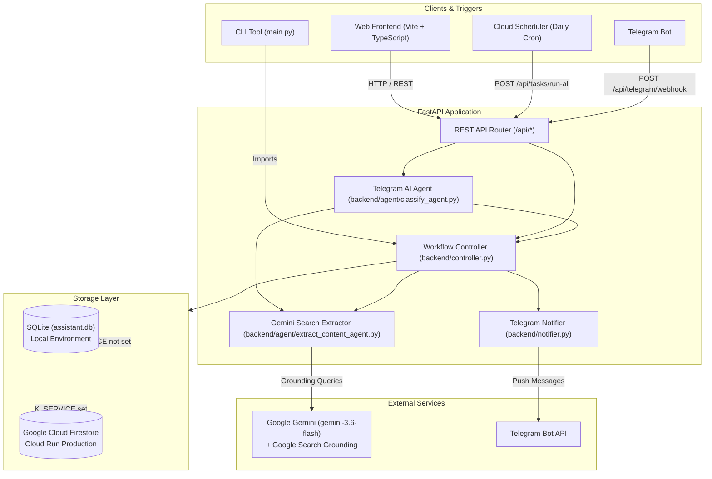

# Personal Search Assistant — Technical & Product Specification

## 1. Overview & Vision
The **Personal Search Assistant** is an autonomous AI-driven search and monitoring agent. It allows users to define recurring or ad-hoc web search tasks in plain natural language (e.g., *"Find me jobs in Tel Aviv Java backend"*, *"Check for apartment rent drops in downtown"*). 

The system leverages **Google Gemini AI with live Google Search Grounding** to search the live web, extract structured items (titles, links, locations, details), persist state locally or in the cloud, and notify users via **Telegram**, a **responsive Web UI**, and a **CLI interface**.



---

## 2. Directory Structure & File Inventory

The repository is organized into a modular backend, a TypeScript frontend, and deployment configurations:

```
personal_search_assistant/
│
├── SPEC.md                         # This specification document
├── main.py                         # CLI entrypoint for local execution
├── requirements.txt                # Root Python package dependencies
├── test_e2e.py                     # Comprehensive end-to-end test suite
├── deploy_cloud_scheduler.sh       # Script to deploy Google Cloud Scheduler job
├── assistant.db                    # Local SQLite database (auto-generated)
├── debug_last_run.log              # Debug log for the latest task execution
│
├── backend/                        # Backend FastAPI service
│   ├── __init__.py
│   ├── main.py                     # FastAPI app setup, CORS, entrypoint
│   ├── api.py                      # REST API endpoints & Telegram webhook
│   ├── controller.py               # Task execution controller & dispatcher
│   ├── agent/                      # AI agents package
│   │   ├── __init__.py             # Package exports
│   │   ├── classify_agent.py       # Gemini conversational intent classifier
│   │   └── extract_content_agent.py # Gemini live search grounding & extraction
│   ├── db.py                       # Database abstraction & SQLite implementation
│   ├── cloud_db.py                 # Google Cloud Firestore integration
│   ├── notifier.py                 # Telegram notification formatting & HTTP dispatch
│   ├── logger.py                   # Debug logging helper
│   ├── requirements.txt            # Backend-specific Python requirements
│   └── Dockerfile                  # Container definition for Google Cloud Run
│
├── frontend/                       # Web Single-Page Application (SPA)
│   ├── index.html                  # HTML entrypoint with modal and task list UI
│   ├── package.json                # Frontend dependencies (Vite, TypeScript)
│   ├── tsconfig.json               # TypeScript configuration
│   ├── vite.config.ts              # Vite build configuration
│   └── src/
│       ├── main.ts                 # UI controller, event listeners, rendering
│       ├── api.ts                  # REST API client
│       ├── types.ts                # TypeScript interfaces (Task, Payloads)
│       └── styles.css              # Custom styling & responsive layouts
│
└── .github/
    └── workflows/
        └── deploy-backend.yml      # CI/CD deployment workflow to Google Cloud Run
```

---

## 3. Data Models & Schemas

### 3.1 Task Entity
Both SQLite (`tasks` table) and Firestore (`tasks` collection) adhere to this schema:

| Field | Type | Description |
| :--- | :--- | :--- |
| `id` | `INTEGER` | Unique task ID (Autoincrement in SQLite, epoch ms in Firestore) |
| `user_id` | `TEXT` | User identifier (e.g. `noam`) |
| `name` | `TEXT` | Short display title (auto-generated by Gemini or user-defined) |
| `task_description` | `TEXT` | Natural language search prompt / instructions |
| `last_run_at` | `TEXT` | Timestamp of last execution (`YYYY-MM-DD HH:MM:SS`) |
| `last_status` | `TEXT` | Execution state: `SUCCESS`, `FAILED`, or `Pending` |
| `last_result` | `TEXT` | JSON payload of extracted search results |
| `last_error` | `TEXT` | Error trace if last execution failed |
| `created_at` | `TEXT` | Record creation timestamp |

### 3.2 Extracted Result JSON Structure (stored in `last_result`)
```json
{
  "task_title": "Tel Aviv Java Backend Jobs",
  "items": [
    {
      "title": "Senior Backend Developer - Java/Spring",
      "link": "https://example.com/jobs/123",
      "description": "Requires 5+ years experience with Spring Boot, Docker, and AWS.",
      "location": "Tel Aviv-Yafo"
    }
  ]
}
```

---

## 4. API Reference (`/api`)

| Method | Endpoint | Query / Body Parameters | Purpose |
| :--- | :--- | :--- | :--- |
| `GET` | `/api/health` | None | Service health check |
| `GET` | `/api/tasks` | `user_id: string` (query) | Returns all tasks for the given user |
| `POST` | `/api/tasks` | `{ "user_id": string, "task_description": string }` | Creates a new task |
| `PUT` | `/api/tasks/{id}` | `{ "name"?: string, "task_description"?: string }` | Updates task name or prompt |
| `POST` | `/api/tasks/{id}/run` | None (path `id`) | Triggers immediate execution for a task |
| `POST` | `/api/tasks/run-all` | `user_id: string` (query) | Batch executes all tasks & dispatches Telegram summary |
| `DELETE` | `/api/tasks/{id}` | `user_id?: string` (query) | Deletes a task |
| `POST` | `/api/telegram/webhook` | Telegram Update JSON | Ingests Telegram Bot messages & dispatches AI agent actions |

---

## 5. Core Workflows & Intelligence

### 5.1 Search Grounding & Automatic Task Naming (`backend/agent/extract_content_agent.py`)
1. Receives natural language `task_description`.
2. Calls Gemini (`gemini-3.6-flash`) with dynamic Google Search Grounding (`tools: [{"google_search": {}}]`).
3. Formats output into a concise 3-5 word title (`task_title`) and structured `items`.
4. If the task was previously unnamed or had a temporary default name, the controller updates `task.name` to match `task_title`.
5. Includes socket patches on macOS to force IPv4 resolution and avoid DNS lookups hanging on IPv6.

### 5.2 Telegram Conversational Agent (`backend/agent/classify_agent.py`)
The Telegram webhook parses natural language intents using Gemini:
- **`LIST_TASKS`**: "Show my tasks" / "What am I tracking?"
- **`CREATE_TASK`**: "Find me flights to Rome" / "Track used M3 MacBooks"
- **`RUN_TASK`**: "Run task 2" / "Check job listings"
- **`RUN_ALL_TASKS`**: "Run all tasks" / "Check everything"
- **`DELETE_TASK`**: "Delete task 3"
- **`REPLY`**: Conversational replies / Help
- **Security**: Validates incoming `chat.id` against `TELEGRAM_CHAT_ID`.

### 5.3 Frontend Results Presentation & Responsive Cards Layout
- Displays extracted search results for each task in visually rich cards (`.result-item-card`).
- Up to 4 cards are presented horizontally side-by-side in a responsive CSS Grid (`.result-cards-grid`) with dynamically configured column tracks (`--grid-columns`).
- When more than 4 items are present, the first 4 items are shown initially, accompanied by an expand button (`••• Show X more items`) that reveals all remaining cards in the horizontal grid upon click and toggles back to `▲ Show less`.
- Responsive breakpoints ensure readability across devices: up to 4 columns on desktop (> 900px), 2 columns on tablets (641px - 900px), and 1 column on mobile (<= 640px).
- Individual cards format titles, location pills, source website badges with outbound hyperlinks, line-clamped descriptions with tooltip hover, and action buttons.

---

## 6. Deployment & Infrastructure

- **Cloud Run (Production)**: Serverless container hosting the FastAPI backend via `backend/Dockerfile` (`personal-search-assistant-api`).
- **Cloud Run (Staging)**: Dedicated staging service (`personal-search-assistant-api-staging`) deployed automatically on passing pull requests.
- **Cloud Firestore**: Activated automatically when `K_SERVICE` is set in Cloud Run.
- **Cloud Scheduler**: Scheduled trigger deployed via `deploy_cloud_scheduler.sh` running daily (e.g. 20:00 Asia/Jerusalem) against `/api/tasks/run-all`.
- **Frontend Hosting**: Built with Vite and deployable to Vercel (with automatic PR preview deployments).
- **CI/CD Pipelines**:
  - **PR Testing & Staging (`.github/workflows/pr-test-and-staging.yml`)**: Runs full automated tests (`pytest`, `npm run build`) on every pull request. If all tests pass, automatically deploys the backend to the `personal-search-assistant-api-staging` Cloud Run service.
  - **Production Deployment (`.github/workflows/deploy-backend.yml`)**: Automatically deploys the backend to production Cloud Run (`personal-search-assistant-api`) when code is merged into `main`.
