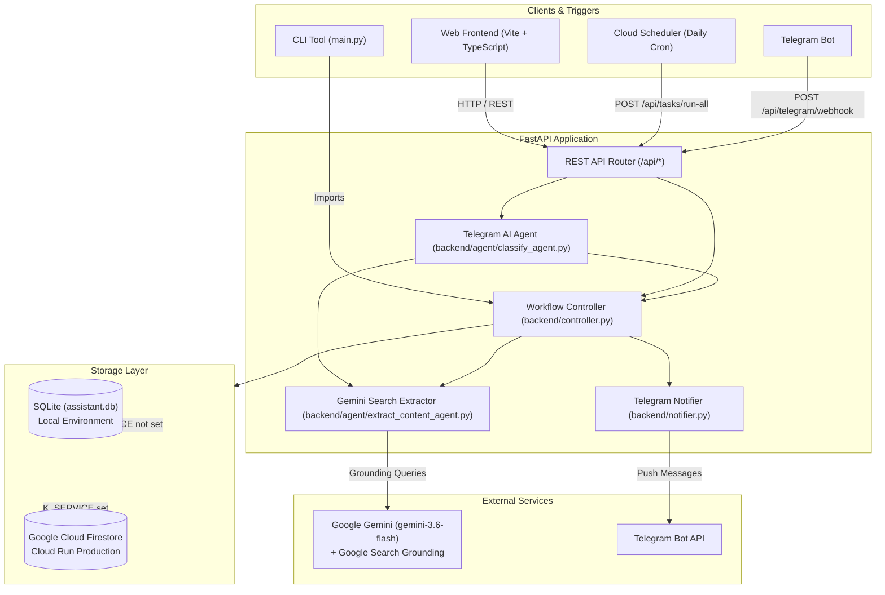

# Personal Search Assistant — Technical & Product Specification

## 1. Overview
The **Personal Search Assistant** is an autonomous AI-driven search and monitoring agent. It allows users to define recurring or ad-hoc web search tasks in plain natural language (e.g., *"Find me jobs in Tel Aviv Java backend"*, *"Check for apartment rent drops in downtown"*). 

The system leverages **Google Gemini AI with live Google Search Grounding** to search the live web, extract structured items (titles, links, locations, details), persist state locally or in the cloud, and notify users via **Telegram**, a **responsive Web UI**, and a **CLI interface**.

## 2. Requirements
- **Natural Language Search Task Management**: Users can create, update, list, run, and delete persistent search tasks defined in plain English.
- **AI Search Grounding & Extraction**: The agent executes live Google Search queries via Gemini (`gemini-3.6-flash`), extracts structured results (title, URL, description, location, source domain), and auto-names tasks.
- **Telegram Conversational Interface**: An interactive Telegram Bot powered by Gemini parses conversational user messages (create task, list tasks, run task, batch run, delete task).
- **Multi-Client Execution**: Supports user-triggered ad-hoc execution via Web UI, automated batch runs via daily Cloud Scheduler cron, and manual runs via CLI.
- **Dual-Database Persistence**: Automatically uses SQLite (`assistant.db`) locally and Google Cloud Firestore in production when running on Google Cloud Run.
- **Responsive Web Interface**: Displays tasks, execution status, live date, top-right user switcher, and extraction results in a horizontal cards layout with expandable items.

## 3. User Experience
- **Header Layout**:
  - **Left**: Application title (`AI Personal Search Assistant`), GitHub repository link (`GitHub Repository ↗`), and connected backend API Base URL indicator (`API: <url> ↗`) placed below the GitHub link in `.header-brand`.
  - **Top Right (2-Tier Layout)**:
    - **Top Line (above actions)**: User selector row (`👤 User: [noam]`) right-aligned at the top of the screen.
    - **Bottom Line (below user selector)**: Primary action buttons (`+ New Task`, `Refresh`, `Run All`) right-aligned.
- **Task Cards**:
  - Displays task name, status badge (`SUCCESS`, `FAILED`, `RUNNING`, `Pending`), task description, last run timestamp, and action buttons (`Run Task`, `✏️ Edit`, `Delete`).
- **Extraction Results Presentation**:
  - Up to 4 extracted items are displayed horizontally side-by-side in a responsive CSS Grid (`.result-cards-grid`).
  - When more than 4 items are extracted, the first 4 items are shown initially, with an expand button (`••• Show X more items`) that reveals all remaining cards upon click and toggles back to `▲ Show less`.
  - Individual cards display title, location pill, source website link, line-clamped description with hover tooltip, and outbound link button (`View Details ↗`).
- **Modal Dialog**:
  - Modal dialog overlay for creating and editing tasks with keyboard accessibility (`ESC` key support and outside-click dismiss).
- **Footer**:
  - Clean application footer (`AI Personal Search Assistant`).

## 4. Architecture
The system follows a modular client-server architecture with an AI agent layer and dual-persistence storage:



### Directory Structure & File Inventory
```
personal_search_assistant/
│
├── SPEC.md                         # Complete project specification (Sections 1-12)
├── main.py                         # CLI entrypoint for local execution
├── requirements.txt                # Root Python package dependencies
├── test_e2e.py                     # Comprehensive end-to-end test suite
├── deploy_cloud_scheduler.sh       # Script to deploy Google Cloud Scheduler job
├── assistant.db                    # Local SQLite database (auto-generated)
├── debug_last_run.log              # Debug log for latest task execution
│
├── backend/                        # Backend FastAPI service
│   ├── __init__.py
│   ├── main.py                     # FastAPI app setup, CORS, entrypoint
│   ├── api.py                      # REST API endpoints & Telegram webhook
│   ├── controller.py               # Task execution controller & dispatcher
│   ├── agent/                      # AI agents package
│   │   ├── __init__.py             # Package exports
│   │   ├── classify_agent.py       # Gemini conversational intent classifier
│   │   ├── extract_content_agent.py# Gemini live search grounding & extraction
│   │   └── skills.py               # Workspace skill loader
│   ├── db.py                       # Database abstraction & SQLite implementation
│   ├── cloud_db.py                 # Google Cloud Firestore integration
│   ├── notifier.py                 # Telegram notification formatting & HTTP dispatch
│   ├── logger.py                   # Debug logging helper
│   ├── requirements.txt            # Backend-specific Python requirements
│   └── Dockerfile                  # Container definition for Google Cloud Run
│
├── frontend/                       # Web Single-Page Application (SPA)
│   ├── index.html                  # HTML entrypoint with 2-tier header & modal
│   ├── package.json                # Frontend dependencies (Vite, TypeScript)
│   ├── tsconfig.json               # TypeScript configuration
│   ├── vite.config.ts              # Vite build configuration
│   └── src/
│       ├── main.ts                 # UI controller, event listeners, card rendering
│       ├── api.ts                  # REST API client
│       ├── types.ts                # TypeScript interfaces (Task, Payloads)
│       └── styles.css              # Custom styling, 2-tier header & card grid
│
└── .github/
    └── workflows/
        ├── deploy-backend.yml      # CD workflow to deploy backend to production on main
        └── pr-test-and-staging.yml # CI/CD workflow running tests & deploying to staging on PR
```

## 5. Technology Stack
- **Backend**: Python 3.12, FastAPI, Uvicorn, Google GenAI SDK (`google-genai`), HTTPX, BeautifulSoup4, pytest.
- **AI Model**: Google Gemini (`gemini-3.6-flash`) with dynamic Google Search Grounding (`tools: [{"google_search": {}}]`).
- **Frontend**: TypeScript, Vite 5, Vanilla DOM / Modern CSS (CSS Grid, Flexbox, Container Queries).
- **Storage**: SQLite 3 (local development), Google Cloud Firestore (Cloud Run serverless production).
- **Cloud Infrastructure**: Google Cloud Run, Google Cloud Scheduler, Vercel (Frontend hosting & PR previews).
- **CI/CD**: GitHub Actions (`pr-test-and-staging.yml`, `deploy-backend.yml`).

## 6. Backend
- **REST API Router (`backend/api.py`)**: Exposes endpoints for task CRUD, single/batch task execution, health check, and Telegram webhook.
- **Workflow Controller (`backend/controller.py`)**: Orchestrates task execution, dispatches extraction to Gemini, updates database state, auto-names tasks, and triggers notifications.
- **Search Extraction Agent (`backend/agent/extract_content_agent.py`)**: Calls Gemini with Search Grounding to extract structured items and generate concise task titles. Injects workspace skills from `.agents/skills/`. Includes IPv4 socket fallback for macOS networking.
- **Intent Classifier (`backend/agent/classify_agent.py`)**: Parses Telegram messages into actions (`CREATE_TASK`, `LIST_TASKS`, `RUN_TASK`, `RUN_ALL_TASKS`, `DELETE_TASK`, `REPLY`).
- **Persistence (`backend/db.py`, `backend/cloud_db.py`)**: Transparent switching between SQLite and Cloud Firestore based on the `K_SERVICE` environment variable.
- **Notifier (`backend/notifier.py`)**: Formats extraction results into clean Markdown Telegram messages with hyperlinks and sends them via Telegram Bot API.

## 7. Frontend
- **SPA Entrypoint (`frontend/index.html`)**: Defines structure including the 2-tier right-aligned header, brand GitHub link, task card list, and create/edit modal.
- **Header Layout**:
  - `.header-brand`: Title, brand GitHub repository link (`.brand-github-link`), and connected API URL badge (`.brand-api-url`).
  - `.header-right`: Flex column right-aligned container.
  - `.user-selector-row`: Top line with user ID input (`userIdInput`).
  - `.header-actions`: Bottom line with New Task button, Refresh button, and Run All button.
- **Results Card Grid (`frontend/src/styles.css`, `frontend/src/main.ts`)**:
  - Renders up to 4 items horizontally in `.result-cards-grid` with dynamic `--grid-columns: 1..4`.
  - Extra items (> 4) rendered inside `.extra-results-container.hidden` and toggled via `.expand-results-btn`.
  - Responsive breakpoints: 4 columns on desktop (>900px), 2 columns on tablets (641px–900px), and 1 column on mobile (≤640px).
- **Dynamic API Base URL Resolution (`frontend/src/api.ts`)**:
  - Automatically resolves backend target via `resolveApiBaseUrl()`:
  - If `VITE_API_URL` is set, uses that URL.
  - If hosted on Vercel preview/staging (`*.vercel.app` containing `git-`, `preview`, or `staging`), routes to Cloud Run Staging (`https://personal-search-assistant-api-staging-6dekvxzgaq-uc.a.run.app`).
  - If hosted on Vercel production, routes to Cloud Run Production (`https://personal-search-assistant-api-6dekvxzgaq-uc.a.run.app`).
  - Falls back to `http://localhost:8000` for local development.

## 8. Data Model
### Task Entity Schema
Both SQLite (`tasks` table) and Firestore (`tasks` collection) adhere to this schema:

| Field | Type | Description |
| :--- | :--- | :--- |
| `id` | `INTEGER` | Unique task ID (Autoincrement in SQLite, epoch ms in Firestore) |
| `user_id` | `TEXT` | User identifier (e.g. `noam`) |
| `name` | `TEXT` | Short display title (auto-generated by Gemini or user-defined) |
| `task_description` | `TEXT` | Natural language search prompt / instructions |
| `last_run_at` | `TEXT` | Timestamp of last execution (`YYYY-MM-DD HH:MM:SS`) |
| `last_status` | `TEXT` | Execution state: `SUCCESS`, `FAILED`, or `Pending` |
| `last_result` | `TEXT` | JSON payload of extracted search results |
| `last_error` | `TEXT` | Error trace if last execution failed |
| `created_at` | `TEXT` | Record creation timestamp |

### Extracted Result JSON Structure (stored in `last_result`)
```json
{
  "task_title": "Tel Aviv Java Backend Jobs",
  "items": [
    {
      "title": "Senior Backend Developer - Java/Spring",
      "link": "https://example.com/jobs/123",
      "description": "Requires 5+ years experience with Spring Boot, Docker, and AWS.",
      "location": "Tel Aviv-Yafo",
      "website": "example.com"
    }
  ]
}
```

## 9. API
| Method | Endpoint | Query / Body Parameters | Purpose |
| :--- | :--- | :--- | :--- |
| `GET` | `/api/health` | None | Service health check |
| `GET` | `/api/tasks` | `user_id: string` (query) | Returns all tasks for the given user |
| `POST` | `/api/tasks` | `{ "user_id": string, "task_description": string }` | Creates a new task |
| `PUT` | `/api/tasks/{id}` | `{ "name"?: string, "task_description"?: string }` | Updates task name or prompt |
| `POST` | `/api/tasks/{id}/run` | None (path `id`) | Triggers immediate execution for a task |
| `POST` | `/api/tasks/run-all` | `user_id: string` (query) | Batch executes all tasks & dispatches Telegram summary |
| `DELETE` | `/api/tasks/{id}` | `user_id?: string` (query) | Deletes a task |
| `POST` | `/api/telegram/webhook` | Telegram Update JSON | Ingests Telegram Bot messages & dispatches AI agent actions |

## 10. Configuration
- **`GEMINI_API_KEY`**: Google Gemini API key used for live search grounding and intent classification.
- **`TELEGRAM_BOT_TOKEN`**: Bot authentication token from BotFather for sending notifications and webhook processing.
- **`TELEGRAM_CHAT_ID`**: Authorized Telegram chat identifier for receiving automated updates.
- **`K_SERVICE`**: Environment variable set automatically by Cloud Run; when present, enables Firestore over SQLite.
- **`GCP_SA_KEY`**: GitHub Actions secret containing service account JSON credentials for Google Cloud deployments.
- **`VITE_API_URL`**: Frontend environment variable optionally overriding backend API base URL (defaults dynamically to Cloud Run Staging on Vercel preview/staging, Cloud Run Production on Vercel production, or `http://localhost:8000` for local dev).

## 11. Testing
- **End-to-End Test Suite (`test_e2e.py`)**:
  - `test_db_operations`: SQLite CRUD operations and state tracking.
  - `test_fastapi_rest_endpoints`: Health check, task CRUD, and execution endpoints.
  - `test_telegram_notifier`: Message formatting and HTTP dispatch with mocked credentials.
  - `test_telegram_webhook_commands`: Conversational intent parsing and authentication checks.
  - `test_workspace_skills`: Workspace skill discovery from `.agents/skills/`.
  - `test_frontend_brand_github_link`: GitHub repository link in brand header and date replacement.
  - `test_frontend_repo_link`: GitHub link placement in brand header and removal from actions and footer.
  - `test_frontend_horizontal_card_grid`: Up to 4 horizontal cards, expand toggle, and CSS grid rules.
  - `test_pr_ci_staging_workflow`: GitHub Actions PR testing and staging deployment workflow validation.
  - `test_frontend_user_selector_layout`: 2-tier header right alignment with user selector row on top line.
  - `test_frontend_api_base_url_resolution`: Verifies dynamic API base URL resolution to Staging, Production, and Local dev.
  - `test_frontend_api_base_url_display`: Verifies API base URL element under GitHub link in the brand header.
  - `test_e2e_live_api`: Live Gemini search grounding test (runs when `GEMINI_API_KEY` is present).
- **Frontend Build Verification**: `npm run build` (`tsc && vite build`) verifying TypeScript types and asset bundling.

## 12. Deployment
- **Cloud Run (Production)**: Serverless backend container deployed automatically via `.github/workflows/deploy-backend.yml` on push to `main` (`personal-search-assistant-api`).
- **Cloud Run (Staging)**: Dedicated staging backend deployed automatically via `.github/workflows/pr-test-and-staging.yml` on passing pull requests (`personal-search-assistant-api-staging`).
- **Cloud Scheduler**: Daily cron job deployed via `deploy_cloud_scheduler.sh` triggering `/api/tasks/run-all`.
- **Frontend Hosting**: Deployable to Vercel with automatic pull request preview deployments.
